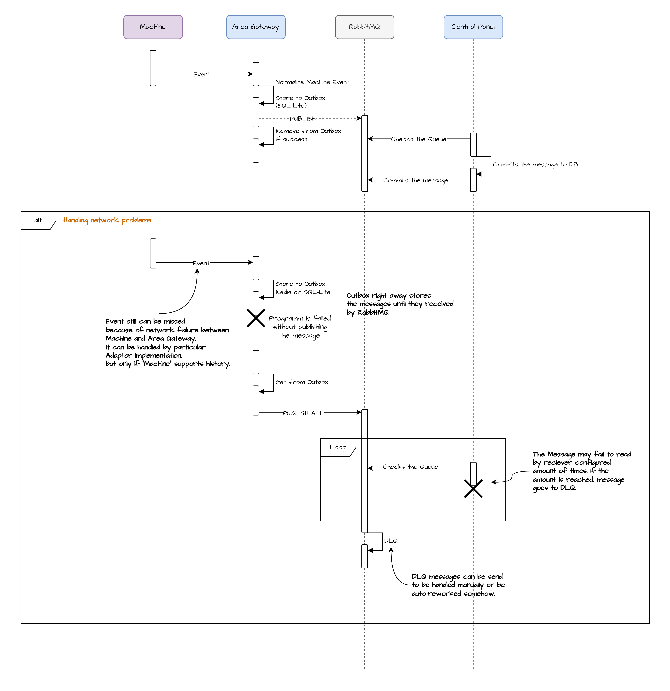

# 6. Runtime View

The Runtime View describes the most important dynamic interactions between the building blocks introduced in Section 5.

The selected scenarios focus on the behavior that is architecturally relevant for the solution:

- reliable telemetry delivery from an Area Gateway to the Central Panel;
- recovery from communication and processing failures;
- local machine-to-workplace communication;
- workplace reconnection and event replay;
- centralized configuration updates.

## 6.1 Telemetry Delivery: Area Gateway to Central Panel

This scenario shows the normal telemetry delivery path from an industrial machine through the Area Gateway and RabbitMQ into the Central Panel.



### Flow

1. **A machine produces an event.**  
   The Area Gateway receives the event through the corresponding industrial protocol and converts it into the representation required for telemetry processing.

2. **The Area Gateway persists the telemetry event locally.**  
   The event is passed to the Telemetry Service and synchronously stored in the local Telemetry Outbox before asynchronous delivery begins.

3. **The Telemetry Service publishes the event to RabbitMQ.**  
   Pending Outbox entries are published asynchronously. The entry remains in the Outbox until RabbitMQ confirms successful receipt of the message. After broker acknowledgement, the corresponding Outbox entry can be removed.

4. **The Central Panel consumes and persists the telemetry event.**  
   The Telemetry Worker consumes the message from RabbitMQ, processes and normalizes it where required, and stores the resulting telemetry data in the Central Panel Storage.

5. **The Telemetry Worker acknowledges successful processing.**  
   RabbitMQ is acknowledged only after the telemetry event has been successfully persisted. The message can then be removed from the queue.

This results in two separate delivery guarantees: the Area Gateway retains telemetry until RabbitMQ accepts it, while RabbitMQ retains the message until the Central Panel successfully processes it.

## 6.2 Telemetry Delivery: Handling Communication and Processing Failures

This scenario describes how telemetry delivery behaves when the Area Gateway, network, RabbitMQ connection, or Central Panel processing path becomes temporarily unavailable.

[PASTE Sequence Diagram - Message Delivery: Area Gateway → Central Panel - Failure Handling]

### Flow

1. **An event can be lost before it reaches the Area Gateway.**  
   A network interruption between a machine and the Area Gateway may prevent an event from being received at all. Where supported by the machine interface, for example by an OPC UA server exposing historical data, a protocol adapter may retrieve missing information after reconnection. This capability is machine- and protocol-dependent and is therefore not guaranteed by the integration solution.

2. **Received telemetry is immediately persisted in the Telemetry Outbox.**  
   Once an event reaches the Area Gateway, it is stored locally before publication to RabbitMQ is attempted.

3. **Area Gateway or network failure does not remove pending telemetry.**  
   If the Gateway Application stops, RabbitMQ is unavailable, or the connection is interrupted before successful publication, the telemetry remains in the Outbox. After the system or connection becomes available again, the Telemetry Service reads the pending entries and resumes publication.

4. **Central processing failures are handled through controlled message retries.**  
   The Telemetry Worker consumes messages from RabbitMQ. If processing or persistence fails, the message is not acknowledged as successfully processed and is retried according to the configured delivery policy.

5. **Messages that repeatedly fail are isolated in a Dead-Letter Queue (DLQ).**  
   After the configured retry limit is reached, the failing message is routed to a DLQ instead of blocking normal telemetry processing.

6. **DLQ remediation is an operational responsibility.**  
   The architecture provides isolation of failed messages through the DLQ. The final operational strategy - such as manual inspection, correction and replay, or automated reprocessing - is intentionally left to the deployment environment and operational requirements.

## 6.3 Message Delivery: Area Gateway to Local Workplace

Local workplace communication is handled entirely within the production area and does not depend on the Central Panel.

The runtime scenario contains two independent flows: continuous machine-event delivery and execution of workplace commands.

[PASTE Sequence Diagram - Message Delivery: Area Gateway → Local Workplace]

### Machine Event Delivery

1. **The Workplace establishes an SSE connection.**  
   The Workplace opens a persistent SSE connection to the Area Gateway and remains ready to receive machine events.

2. **A machine event is received by the Area Gateway.**  
   The corresponding Protocol Adapter receives the machine event and the Area Gateway processes it for internal distribution.

3. **The event is stored in the Recent Event Journal.**  
   Replayable events receive a monotonically ordered `Sequence_ID` and are temporarily persisted in the local Event Journal.

4. **The Area Gateway publishes the event through the SSE endpoint.**  
   The event, including its sequence identifier, is forwarded to the active SSE stream.

5. **The Workplace receives the event.**  
   The Workplace processes the event and remembers its identifier so that missing events can later be requested after a connection interruption.

### Workplace Command Execution

1. **The Workplace submits a command through the REST API.**  
   For example:

   ```text
   POST /machines/{id}/commands/{command}
   ```

2. **The API validates the request.**  
   The Area Gateway verifies that the requested machine, command, and supplied parameters are valid and allowed.

3. **The validated command is forwarded to the gateway runtime.**  
   The API passes the approved operation to the machine-communication logic.

4. **The Area Gateway executes the operation on the machine.**  
   The appropriate Protocol Adapter translates the operation into the corresponding industrial protocol request and performs the machine write or command execution.

## 6.4 Local Workplace Communication: Connection Recovery

The Recent Event Journal provides short-term recovery when the SSE connection between a Workplace and its Area Gateway is interrupted.

[PASTE Sequence Diagram - Area Gateway → Local Workplace - Connection Recovery]

### Flow

1. **The SSE connection is lost.**  
   The Workplace temporarily stops receiving live machine events.

2. **The Workplace reconnects with its last processed event identifier.**  
   During reconnection, the Workplace provides the last successfully processed event ID, for example:

   ```text
   Last-Event-ID: 18422
   ```

3. **The Area Gateway determines which events were missed.**  
   The SSE/API functionality queries the Recent Event Journal for events with:

   ```text
   Sequence_ID > 18422
   ```

4. **The Event Journal returns the available missing events.**  
   For example:

   ```text
   18423, 18424, 18425
   ```

5. **The missing events are replayed in sequence.**  
   The SSE endpoint sends the recovered events to the Workplace in their original sequence order.

6. **Live SSE delivery continues.**  
   After replay is complete, the Workplace continues receiving new events through the normal live stream.

This recovery mechanism is limited by the retention period of the Recent Event Journal. It provides short-term communication recovery rather than permanent event history.

## 6.5 Configuration Update through the Central Panel

Configuration changes are created centrally, published explicitly, retrieved by the corresponding Area Gateway, validated locally, and activated only after successful validation.

[PASTE Sequence Diagram - Configuration Update]

The configuration lifecycle is divided into four stages.

### 6.5.1 Create and Save Draft

1. **The Engineer edits an Area Gateway configuration.**  
   Configuration changes are made through the Central Panel UI Dashboard.

2. **The UI Dashboard saves the configuration as a draft.**  
   The Dashboard sends the changed configuration to the Configuration API.

3. **The Configuration API persists the draft.**  
   The new version, for example `v42`, is stored in the Central Panel Storage with draft status. It is not yet distributed to an Area Gateway.

### 6.5.2 Publish Configuration

1. **The Engineer explicitly publishes the draft.**  
   After reviewing the configuration, the Engineer selects the publish action in the UI Dashboard.

2. **The UI Dashboard sends the publish request to the Configuration API.**

3. **The Configuration API marks version `v42` as published and available for retrieval.**  
   The previously applied configuration remains active until the Area Gateway successfully validates and activates the new version.

### 6.5.3 Area Gateway Retrieves and Validates Configuration

1. **The Area Gateway periodically checks for a newer published configuration.**  
   The Gateway Configuration Service queries the Central Panel Configuration API using its currently applied configuration version.

2. **The Configuration API returns the latest published configuration when a newer version exists.**

3. **The Area Gateway stores the received version as a candidate configuration.**  
   The candidate is persisted in the local Gateway Storage before it replaces the currently applied configuration.

4. **The candidate configuration is validated.**  
   The Area Gateway validates the configuration structure, required values, machine definitions, nodes, and other applicable integration settings.

5. **Validation succeeds.**  
   The validator reports that the candidate can be used by the Gateway Application.

6. **The candidate is marked as valid.**  
   At this point the configuration is ready for activation, while the previously applied version remains available until the activation step succeeds.

### 6.5.4 Activate New Configuration

1. **The Area Gateway activates the validated configuration version `v42`.**

2. **The currently applied configuration is replaced.**  
   Version `v42` becomes the new Applied Configuration, replacing version `v41`.

3. **The Area Gateway reports successful activation to the Central Panel.**  
   The Configuration Service informs the Configuration API that version `v42` has been successfully applied.

4. **The Central Panel updates the configuration state.**  
   Version `v42` is marked as applied, while the previous version is marked as superseded.

This lifecycle prevents an edited or merely published configuration from immediately replacing a working gateway configuration. A new version becomes operational only after it has been retrieved, validated, and successfully activated by the corresponding Area Gateway.
