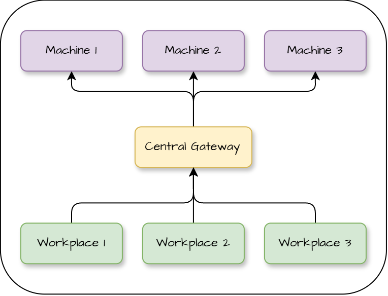
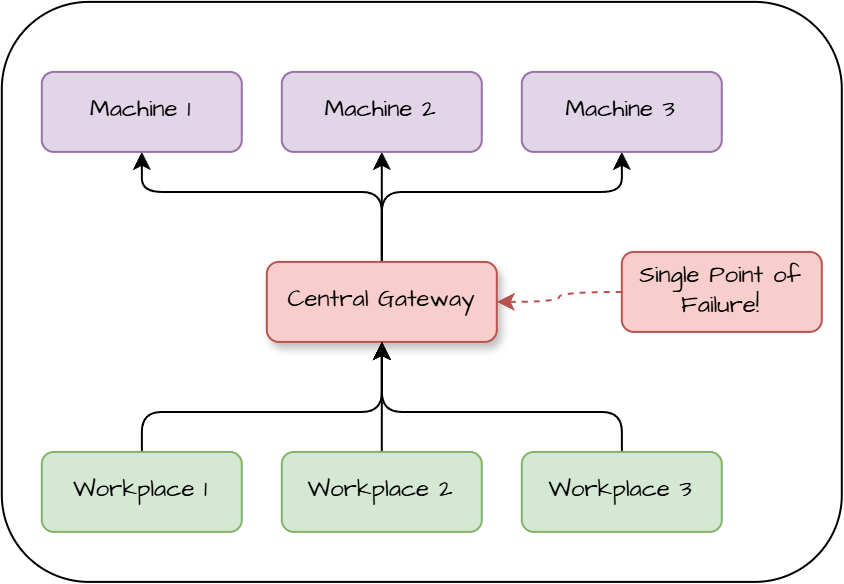

# Industrial Protocol Integration System

Architecture documentation for a distributed industrial integration platform designed to connect existing production machines with workplace applications while providing centralized telemetry, configuration, and monitoring.

> This repository contains **architecture documentation only**.  
> It does not contain the implementation source code of the system.

The architecture is documented using **arc42** as the documentation structure and **C4** diagrams where they provide a useful architectural view.

---

## The Idea

Industrial environments often contain machines from different vendors using different communication protocols, while multiple workplace applications need access to the same machine data and operations.

A simple first approach is to introduce a central Gateway between workplaces and machines.



The Gateway provides one integration point for machine communication and prevents every Workplace from implementing its own industrial protocol integration.

However, this architecture introduces a major problem.

---

## The Problem: Single Point of Failure

If all machines and workplaces depend on one Gateway, that Gateway becomes a **Single Point of Failure (SPOF)**.



If the Gateway becomes unavailable:

- all connected Workplaces lose access to their machines;
- machine communication for the entire environment is interrupted;
- failure of one integration component affects otherwise unrelated production areas.

For an industrial environment, this creates an unnecessarily large failure domain.

---

## Proposed Architecture

The final architecture distributes machine integration across independent **production Areas**.

Each Area receives its own **Area Gateway**, responsible only for the machines and workplaces assigned to that Area.

A separate **Central Panel** provides centralized telemetry, configuration, monitoring, reporting, and analytics.

**[Insert: System Landscape Diagram]**

The main architectural principles are:

- machine communication is distributed between independent Area Gateways;
- local Workplace communication remains inside the corresponding production Area;
- failures of one Area Gateway do not directly affect other Areas;
- industrial protocols are hidden behind standardized application interfaces;
- telemetry is collected centrally without putting the Central Panel into the local production communication path;
- RabbitMQ decouples telemetry producers from central telemetry processing;
- local Gateway storage protects telemetry during network or central infrastructure failures;
- configuration is managed centrally but retained locally by each Area Gateway.

The result is a system that combines **local operational independence** with **centralized visibility and management**.

---

## Architecture Documentation

The repository follows the arc42 documentation structure.

Each section is stored in its own directory and contains a `README.md` together with the diagrams and additional artifacts belonging to that architectural view.

```text
/
├── README.md
├── assets/
│
├── 01-introduction-and-goals/
│   └── README.md
│
├── 02-constraints/
│   └── README.md
│
├── 03-context-and-scope/
│   ├── README.md
│   └── diagrams/
│
├── 04-solution-strategy/
│   └── README.md
│
├── 05-building-block-view/
│   ├── README.md
│   └── diagrams/
│
├── 06-runtime-view/
│   ├── README.md
│   └── diagrams/
│
├── 07-deployment-view/
│   ├── README.md
│   └── diagrams/
│
├── 08-architectural-decisions/
│   └── README.md
│
├── 09-quality-requirements/
│   └── README.md
│
├── 10-risks-and-technical-debt/
│   └── README.md
│
└── 11-glossary/
    └── README.md
